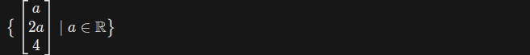

# ACA_finals
Final projects for Python section of ACA Intro to ML and DS course

This repository contains 4 simple projects:
- File Organizer
- Health Tracker
- Calendar
- Gauss-Jordan Implementation

### Tips
> To escape problems with `File Organizer`, using absolute paths are recommended.

## Gauss-Jordan Implementation

In this project, you will be required to develop a code that will, given:
- M*N matrix A
- M-sized vector b

solve the equation `Ax=b` using the `Gauss-Jordan Reduction` algorithm.

It should print out the steps (e.g. `R1 - 2*R3`) in a human-friendly format.

Cases to be covered:
- If there is a unique solution, print the solution
- If there is no solution, print that there is no solution
- If there are infinitely many solutions, print them in the form, e.g.,

